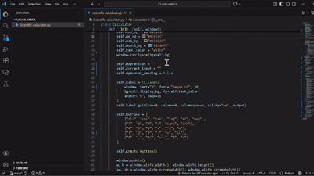

# Scientific Calculator in Python

A professional scientific calculator built with Python and Tkinter, inspired by the Windows Calculator interface. 
It supports basic arithmetic operations, scientific functions, powers, and more.

## Features

- Basic arithmetic: `+`, `-`, `×`, `÷`
- Scientific functions:
  - Trigonometry: `sin`, `cos`, `tan` (degrees)
  - Logarithms: `log` (base 10), `exp`, `π`
  - Powers: `x²`, `xʸ`
  - Square root: `sqrt`
  - Factorial: `x!`
  - Reciprocal: `1/x`
- Toggle positive/negative: `+/-`
- Percentage: `%`
- Clear all: `AC`

Here’s a small snippet showing how the calculator is launched:

  

## Usage Instructions

- Use the buttons to input numbers and operators.
- Click `=` to get results.
- Use scientific functions for advanced calculations.
- Example calculations:
  - `7 × 8 = 56`
  - `√49 = 7`
  - `5 xʸ 3 = 125`
  - `sin(90) = 1`
  

  

